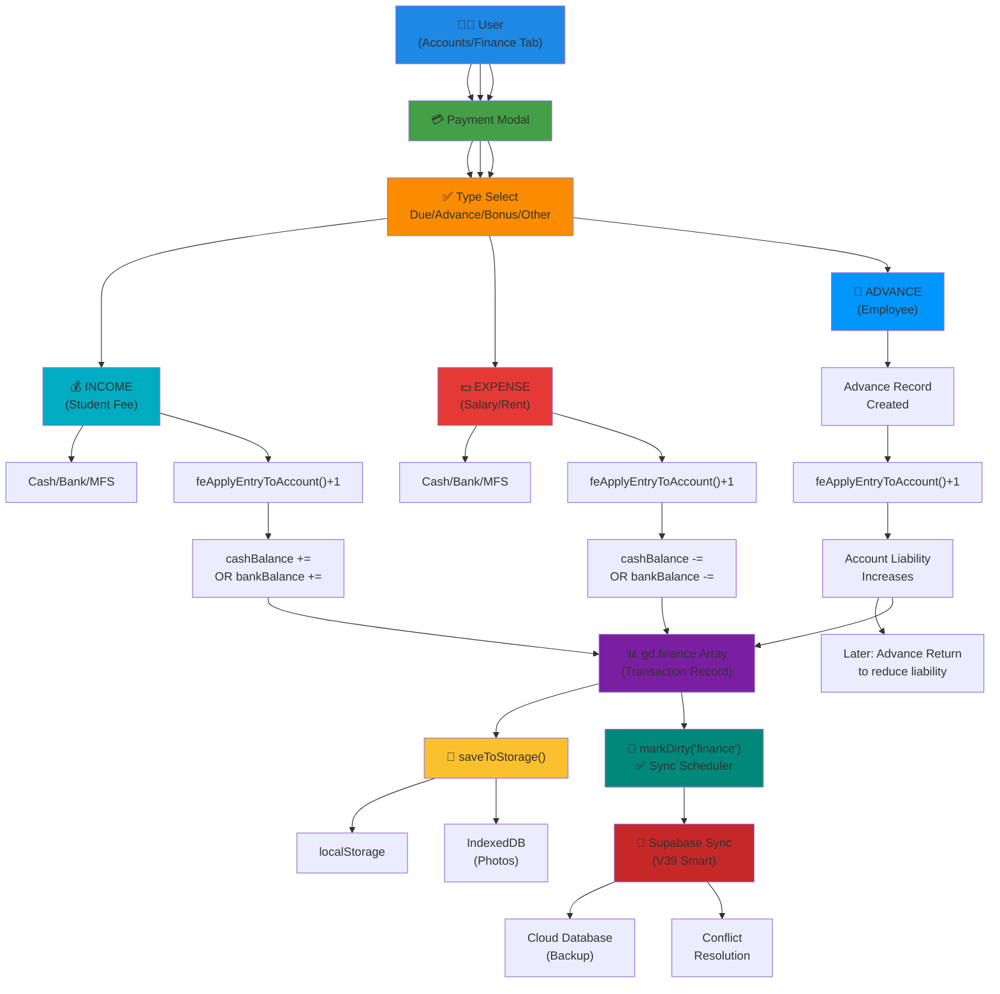
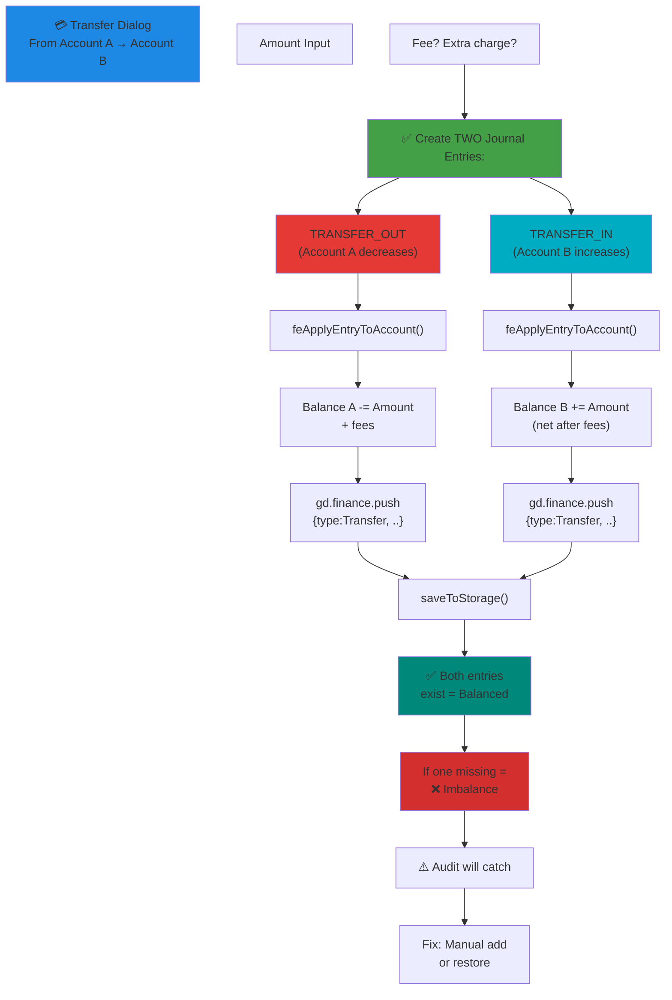
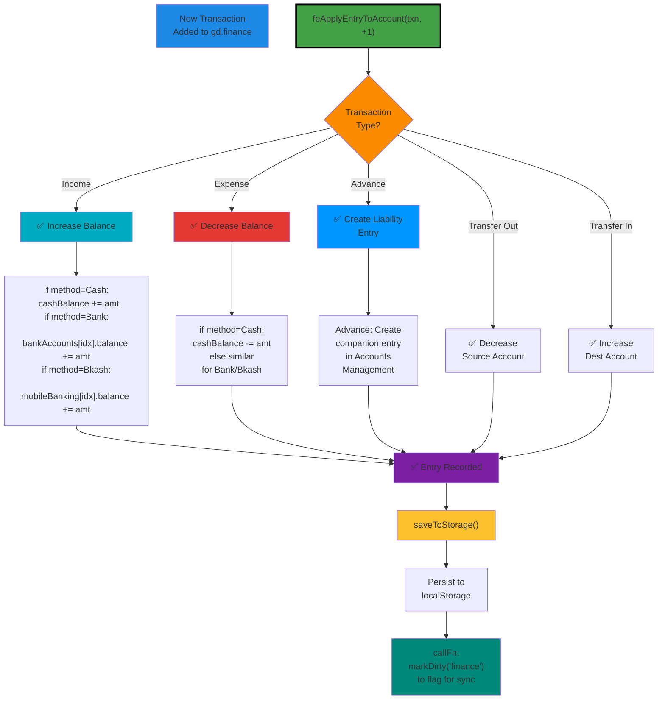
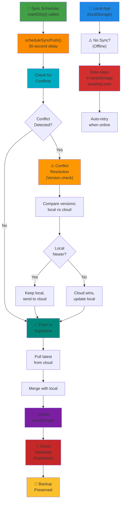
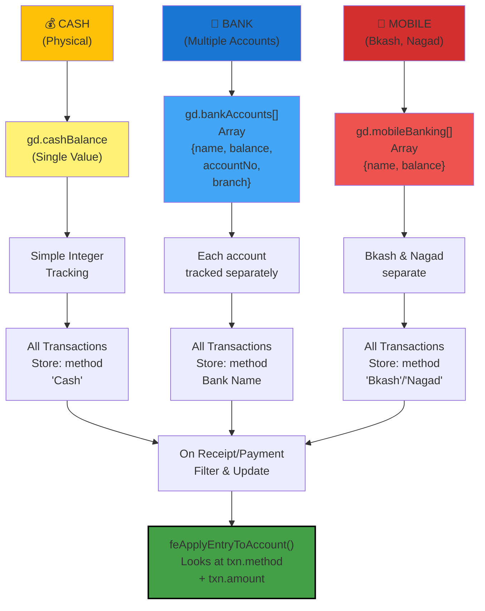
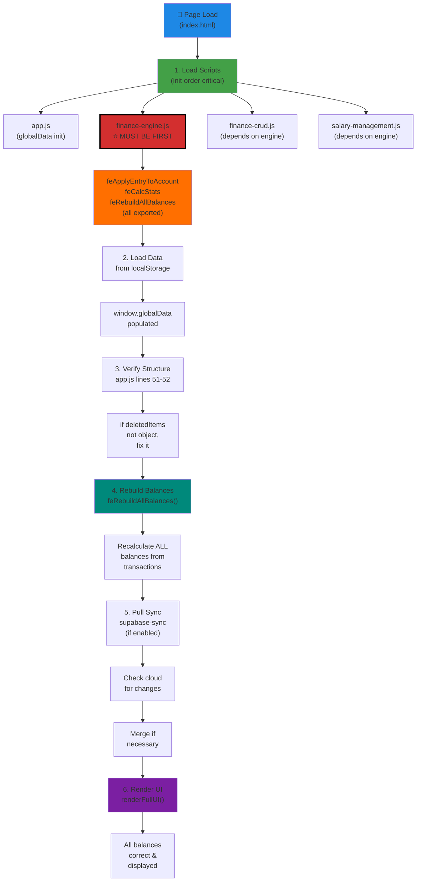
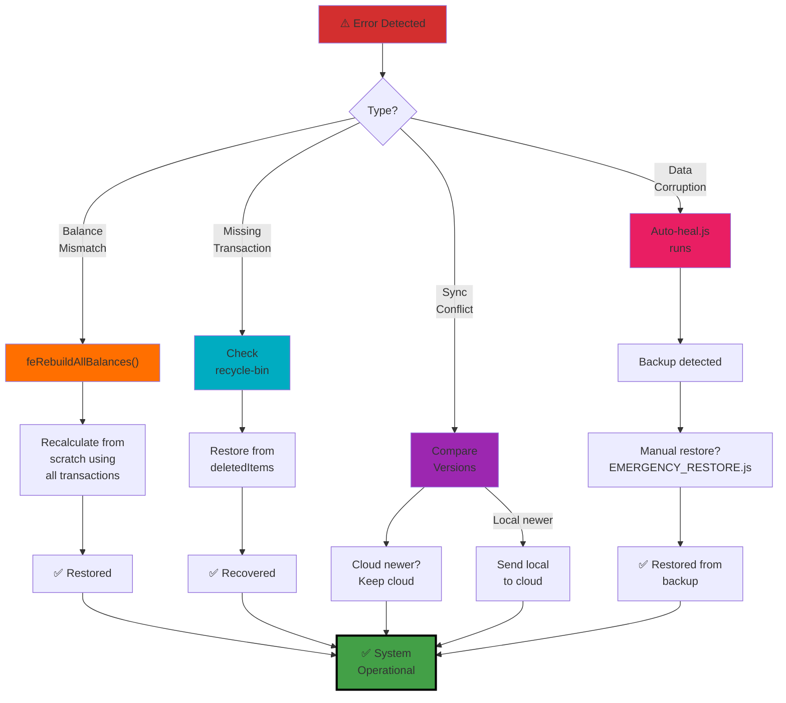

PAYMENT & SYNC ARCHITECTURE DIAGRAM
====================================
Wings Fly Aviation Academy — Financial Flow Design

---

## DIAGRAM 1: PAYMENT FLOW ARCHITECTURE



---

## DIAGRAM 2: TRANSFER MECHANISM (Inter-Account)



---

## DIAGRAM 3: BALANCE UPDATE FLOW (Critical Path)



---

## DIAGRAM 4: SYNC SYSTEM (Supabase V39)



---

## DIAGRAM 5: PAYMENT METHODS & ACCOUNT SEGREGATION



---

## DIAGRAM 6: DATA FLOW ON STARTUP



---

## DIAGRAM 7: ERROR RECOVERY (Safeguards)



---

## KEY IMPLEMENTATION RULES

### ✅ MUST DO
1. **Load finance-engine.js FIRST** — all other modules depend on it
2. **Always use feApplyEntryToAccount()** — never manually update balances
3. **Call saveToStorage()** after every change
4. **Mark dirty** before sync: markDirty('finance')
5. **Verify deletedItems** is object, not array

### ❌ NEVER DO
1. ❌ Adjust balance manually: `gd.cashBalance -= 100` ← WRONG
2. ❌ Skip feApplyEntryToAccount() ← Balance will be wrong
3. ❌ Create single-sided transactions ← Must have entry & update
4. ❌ Modify transaction after creation ← Create new entry, delete old
5. ❌ Override conflict in sync ← Use version control

---

## TESTING THE ARCHITECTURE

### Test 1: Complete Payment Cycle
```
1. Income → Check cashBalance updated
2. Expense → Check cashBalance decreased
3. Transfer → Check both accounts updated
4. Advance & Return → Check liability tracked
```

### Test 2: Sync Integrity
```
1. Make transaction offline
2. Go online
3. Verify sync happens automatically
4. Check cloud has new transaction
```

### Test 3: Balance Audit
```
console.log('Running audit...');
window.runFullAudit();
// All should show ✅
```

============================================================
Last Updated: 27-03-2026
Status: ✅ Architecture is PRODUCTION-GRADE
============================================================
